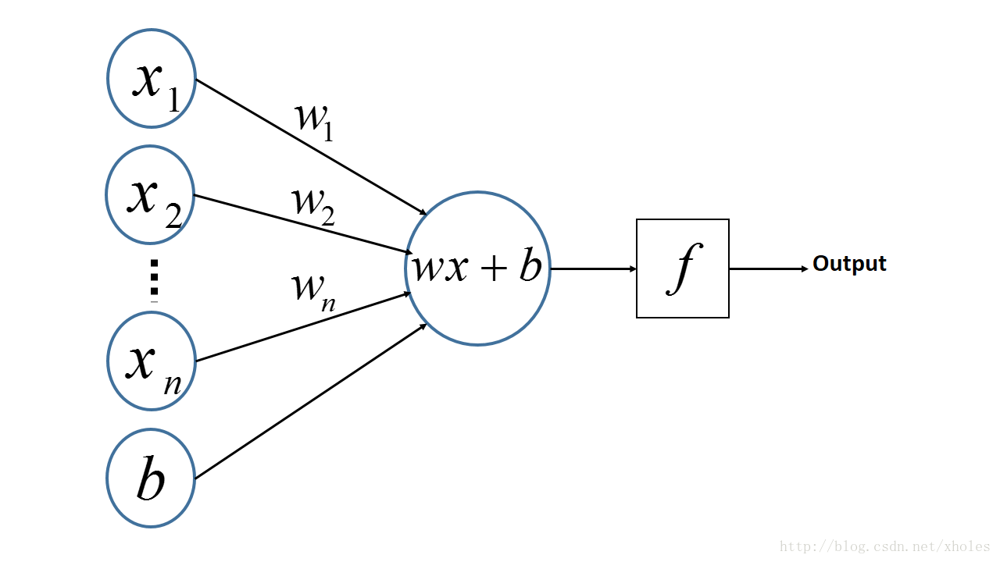

MPL:Multi-Layer Perceptron--多层感知机
=====
>A multilayer perceptron (MLP) is a class of **feedforward artificial neural network**. An MLP consists of, at least, three layers of nodes: an input layer, a hidden layer and an output layer. Except for the input nodes, each node is a neuron that uses a nonlinear activation function. MLP utilizes a supervised learning technique called backpropagation for training.Its multiple layers and non-linear activation distinguish MLP from a linear perceptron. It can distinguish data that is not linearly separable.

>多层感知器是一种前向结构的**人工神经网络**，映射一组输入向量到一组输出向量。MPL可以被看做是一个有向图，由多个节点组成，每一层都全连接到下一层。除了输入节点，每个节点都是一个带有非线性激活函数的神经元（或称处理单元）。一种被称为反向传播算法的监督学习方法常被用来训练MPL。MPL是感知机的推广，克服了感知机感知器不能对线性不可分数据进行识别的弱点。
>感知器（Perceptron），是一种最简单形式的前馈神经网络，是一种**二元线性分类器**。常用的感知机学习算法有：感知机学习、最小二乘法和梯度下降法。为了模拟神经细胞行为，与之对应的感知基础概念是：权量（突触）,偏置（阈值）以及激活函数（细胞体）。
[^_^]:#("超平面")
[^_^]:#("注释")

